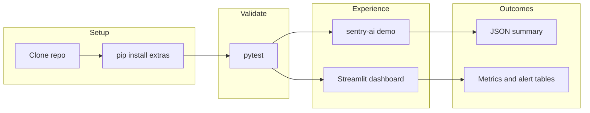
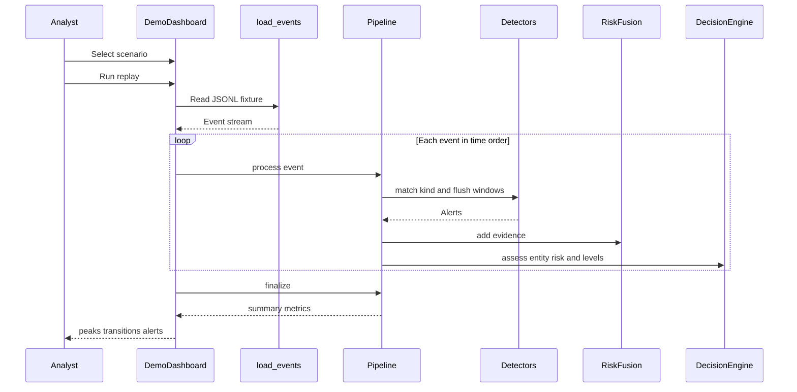
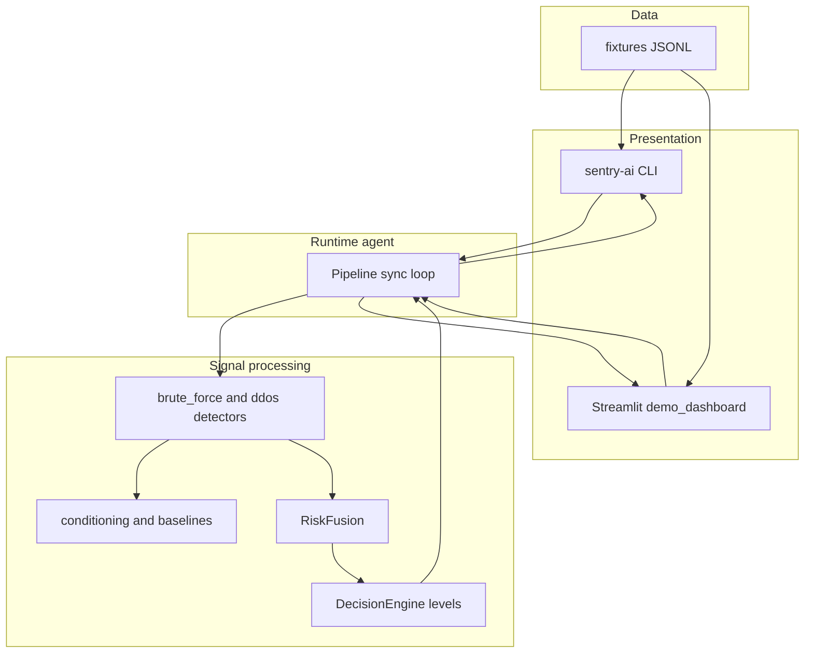
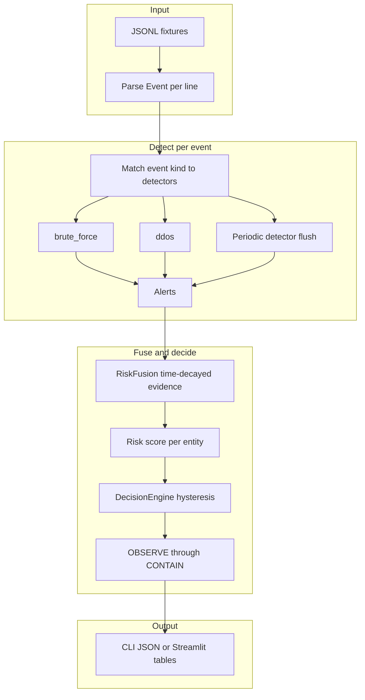
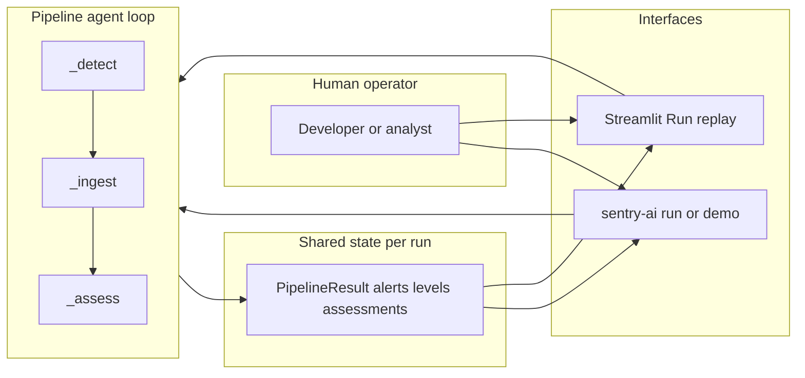

# Sentry-AI

**Sentry-AI** is a compact, standalone demonstration of cybersecurity **signal processing** code taken from [SigSentinel](https://github.com/MrKyaw/sigsentinel). It replays synthetic telemetry through streaming detectors, fuses evidence into a risk score, and maps risk to analyst-facing decision levels—without requiring a live network sensor.

Use this repository for **learning, prototypes, and demos**. For live Zeek deployment, the full detector set, and production response workflows, use the main SigSentinel project.

**In this README:** [User journey](#user-journey) · [System architecture](#system-architecture) · [Agent interaction workflow](#agent-interaction-workflow) · [Quick start](#quick-start)

## What is included

| Layer | Components |
|-------|------------|
| Signal conditioning | EWMA, Welford, MAD, robust z-scores, tumbling/sliding windows |
| Baselines | Hour-of-week seasonal baselines |
| Detectors (sample) | `brute_force`, `ddos` (full SigSentinel modules, repackaged) |
| Fusion & decision | Time-decayed noisy-OR risk, kill-chain bonus, hysteresis levels |
| Runtime | Sync replay pipeline, CLI, optional Streamlit demo UI |

## What is not included

Live Zeek/netflow ingestion, remaining SigSentinel detectors, campaign/intrusion correlators, incidents, SOAR actions, advisor/LLM, and the **production** FastAPI + analyst dashboard stack. Those remain in the main SigSentinel project.

## User journey

Typical paths through this repo (all offline; no sensor required):

| Persona | Goal | Steps |
|---------|------|--------|
| **Evaluator** | Confirm the code runs | Install → `pytest` → read [docs/TEST_RESULTS.md](docs/TEST_RESULTS.md) |
| **Analyst / demo host** | Show detection behavior | Install dashboard extra → Streamlit → pick fixture → **Run replay** → review levels and alerts |
| **Developer** | Trace signal logic | Read [ATTRIBUTION.md](ATTRIBUTION.md) → open `src/sentry_ai/agent/pipeline.py` → replay one fixture with `sentry-ai run fixtures/...` |
| **SigSentinel adopter** | Compare scope | Run Sentry-AI demos here → deploy full stack from [SigSentinel](https://github.com/MrKyaw/sigsentinel) for production |

### Journey overview



### Analyst demo path (sequence)



## System architecture

Sentry-AI is a **layered replay stack**: fixtures and UIs sit above a sync mini-agent loop (`Pipeline`) that wraps the same detect → fuse → decide path used in SigSentinel’s orchestrator (without live ingestion, correlators, or SOAR).

### Layered view



### Processing pipeline

Each JSONL line is a typed **Event** (HTTP flow, connection, etc.). Events are sorted by timestamp and processed in order.



**Processing steps:**

1. **Detect** — For each event, registered detectors update baselines/windows and may emit **Alerts**; periodic flushes catch volume-style patterns (e.g. DDoS).
2. **Ingest** — Alerts are added to **RiskFusion** for the affected entity.
3. **Assess** — Fusion produces a decay-weighted risk score; **DecisionEngine** applies corroboration and hysteresis so levels do not flap (`OBSERVE` → `ALERT` → `RECOMMEND` → `CONTAIN`).
4. **Finalize** — After the last event, detectors flush once more so trailing windows appear in the summary.

Core implementation: [`src/sentry_ai/agent/pipeline.py`](src/sentry_ai/agent/pipeline.py).

## Agent interaction workflow

In this repo, **agent** means the sync **Pipeline** mini-agent (not an LLM): it runs the orchestrator-style loop on replayed events. You interact with it through the **CLI** or **Streamlit** console—there is no long-running daemon or approval queue (those live in full SigSentinel).



| Interaction | Who drives the loop | Typical output |
|-------------|---------------------|----------------|
| `sentry-ai run` / `demo` | CLI loads fixture, calls `Pipeline.run`, prints JSON | Peak levels, transitions, alert counts |
| Streamlit dashboard | UI loads fixture on button click, same `Pipeline` | Metrics, tables, recent alerts |
| Unit / integration tests | `pytest` constructs `Pipeline` directly | Assertions on levels and baselines |

For production **human-in-the-loop** response (approvals, incidents, SOAR), use SigSentinel’s full agent orchestrator and API—not this replay-only stack.

## Quick start

See **[START.md](START.md)** for install, tests, CLI demo, and demo UI steps.

```bash
pip install -e ".[dev]"
pytest
sentry-ai demo
```

## Demo (recommended UI)

For demos, use the **Streamlit replay dashboard** (fixture-based, works offline):

```bash
pip install -e ".[dashboard]"
streamlit run src/sentry_ai/serving/demo_dashboard.py
```

Pick a scenario, click **Run replay**, and walk through metrics, level transitions, and alert tables.

| Mode | Best for |
|------|----------|
| **Streamlit dashboard** | Audience-facing demo; visual tables and metrics |
| **`sentry-ai demo` (CLI)** | Terminal-only or CI; JSON summary |
| **SigSentinel API + dashboard** | Live agent, approvals, and full analyst console (main repo) |

## Test results

Formal scope, test matrix, and scenario benchmarks: **[docs/TEST_RESULTS.md](docs/TEST_RESULTS.md)**.

## Provenance

Module-level mapping to SigSentinel sources: [ATTRIBUTION.md](ATTRIBUTION.md).

## License

MIT — see [LICENSE](LICENSE).
